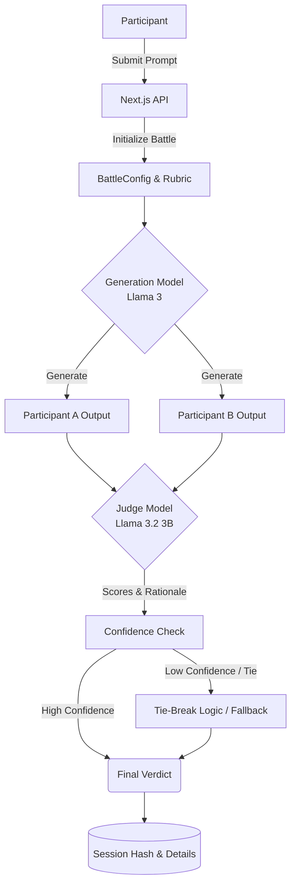
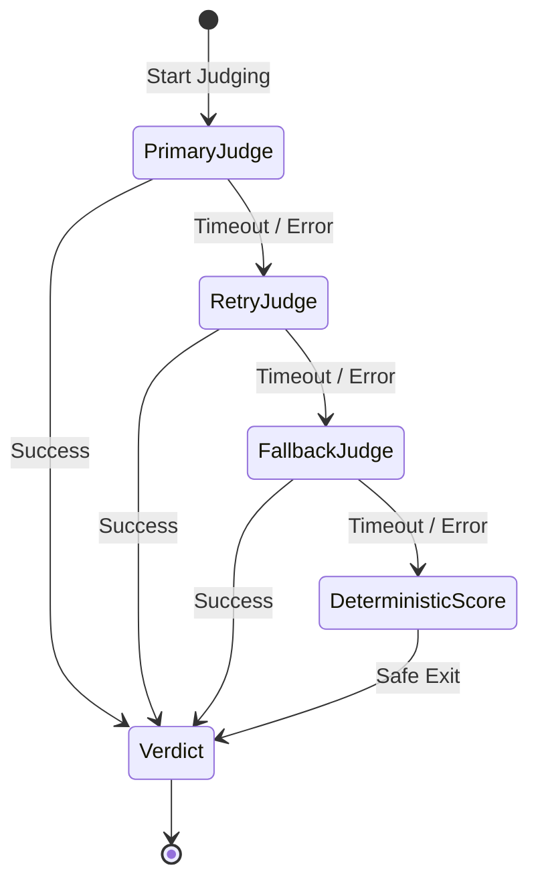
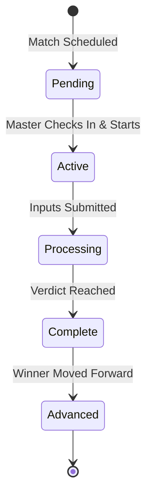
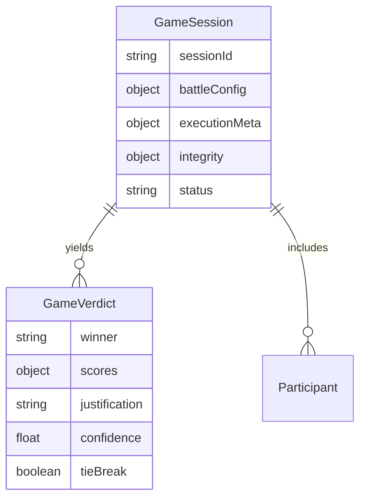

# PromptWars Feature-Depth Execution Roadmap

## Scope

This roadmap is for the **next feature-depth wave** you listed:

1. Judge Rubric Control Panel (Master)
2. Round Replay + Diff Forensics
3. Blind Judging Mode
4. Confidence + Tie-Break Logic
5. Live Spectator “Explainable Judge” Panel
6. Per-field Model Presets
7. Model Fallback Chain
8. Token/Time Budget Guardrails
9. Auto Bracket Progression
10. Master “Next Match in Queue”
11. Soft Penalty System
12. Prompt Similarity / Plagiarism Check
13. System Health Watchdog
14. Immutable Battle Hash

---

## 1) Product objective and success criteria

## Objective
Move PromptWars from event-ready to **premium tournament platform** by making judging:
- transparent,
- configurable,
- auditable,
- robust under local hardware constraints (RTX 4060 8GB).

## Success metrics (target)
- **Judging consistency:** lower rematch/dispute rate by 50%.
- **Ops reliability:** < 1% rounds fail due to model/runtime errors.
- **Latency:** P95 round-complete time remains within acceptable live-event window.
- **Fairness trust:** organizers can explain every verdict with rubric + model trace.

---

## 2) Execution strategy (phased)

## Phase 0 — Foundation hardening (2–3 days)
- Introduce feature flags and schema migration scaffolding.
- Create central `BattleConfig` object carried per session.
- Add telemetry envelope for scoring pipeline.

## Phase 1 — Highest impact trio (1–2 weeks)
- Judge Rubric Control Panel
- Replay + Diff Forensics
- Model Fallback + Confidence Tie-Break

## Phase 2 — Fairness and explainability (1 week)
- Blind Judging Mode
- Explainable Judge spectator panel
- Per-field model presets

## Phase 3 — Tournament ops and integrity (1–2 weeks)
- Auto bracket progression
- Next-match queue board
- Soft penalties
- Prompt similarity check
- Health watchdog
- Immutable battle hash

## Release pattern
- Ship behind flags, validate in dry runs, then enable for live event profile.

---

## 3) Core architecture additions

### System Architecture Flow Visualized

## 3.1 New session config envelope
Add to `GameSession`:

- `battleConfig`: object containing
  - rubric weights
  - blind judge mode
  - model preset profile
  - token/time guardrail values
  - tie-break policy
- `executionMeta`:
  - generation model
  - judge model
  - fallback model used? (boolean + name)
  - confidence score
  - tie-break triggered? why?
- `integrity`:
  - battle hash
  - hash algorithm

## 3.2 New persisted battle artifacts
For each battle record:
- prompt/output raw data
- model metadata
- judge rubric applied
- scoring breakdown
- confidence + tie-break trail
- integrity hash + timestamp

## 3.3 Explainability payload contract
Standard shape for UI cards and replay pages:
- `scores`: alignment/correctness/clarity/creativity
- `weighting`: same keys with percentages
- `justificationShort`: 1–3 safe sentences
- `disqualifications` / `penalties`

---

## 4) Deep plan by feature (with implementation notes)

## 4.1 Judge Rubric Control Panel (Master)

### UX
- Four sliders (0–100 total auto-normalized):
  - Problem Alignment
  - Correctness
  - Clarity
  - Creativity
- Preset chips:
  - Legal
  - Code
  - Business
  - Balanced
- “Lock rubric for this round” toggle.

### Backend
- Add rubric to `battleConfig` in session.
- Feed rubric into judge prompt and deterministic blend logic.
- Store applied rubric in session + saved battle record.

### Acceptance
- Weight changes are reflected in current session pre-execute.
- Saved battle includes exact weights used.

### Risks
- Overfitting weights to favorite participant.
- Mitigation: lock once round starts.

---

## 4.2 Round Replay + Diff Forensics

### UX
- Replay list from saved sessions.
- Open round => side-by-side A/B:
  - prompts
  - outputs
  - model names
  - final verdict
- “What changed?”:
  - prompt diff
  - output diff

### Backend
- Parse existing session logs into structured JSON index (or dual-write going forward).
- Build replay API endpoint:
  - `GET /api/replay/list`
  - `GET /api/replay/:id`

### Acceptance
- Replays open in < 2s for local dataset.
- Diff highlights are clear and readable.

---

## 4.3 Blind Judging Mode

### UX
- Master toggle: “Blind Judge (hide names in judge context)”.
- UI still shows A/B labels; identity reveal after verdict.

### Backend
- Judge prompt builder strips names and personal metadata.
- Battle record stores whether blind mode was active.

### Acceptance
- No participant names in judge prompt payload when enabled.

---

## 4.4 Confidence + Tie-Break Logic

### Confidence
- Ask judge for confidence (0–100) or infer via score gap + rationale quality signals.
- Persist `confidence` in verdict object.

### Tie-break policy
Trigger when:
- confidence < threshold, **or**
- |scoreA - scoreB| <= configured gap.

Tie-break options:
1. deterministic local scoring pass only,
2. secondary judge model pass,
3. both with weighted merge.

### Acceptance
- Tie-break trigger reason is logged and visible in replay.

---

## 4.5 Live Spectator Explainable Judge Panel

### UX
- Panel shows:
  - stage (`executing` / `judging`)
  - active generation/judge model
  - short rubric notes
- Safety: no sensitive raw prompt internals unless allowed.

### Backend
- expose read-only stream/poll endpoint for explainability payload.

### Acceptance
- Spectator panel updates without affecting battle flow latency.

---

## 4.6 Per-field model presets

### Goal
Tune for domain without manual per-round tweaking.

Example presets:
- `law`, `pharma`: stricter correctness and alignment weighting.
- `computer_science`: larger generation token cap.

### Backend
- preset resolver runs at session creation from selected field.
- master can override preset before start.

---

## 4.7 Model fallback chain

### Fallback State Machine

### Flow
If judge call fails/timeouts:
1. retry same model once (short timeout)
2. fallback judge model (e.g. `llama3:latest`)
3. deterministic fallback verdict

### Logging
- `fallbackUsed`, `fallbackModel`, `errorReason` in session record.

### Acceptance
- No hard crash path; every round ends with a verdict or explicit DQ state.

---

## 4.8 Token/time budget guardrails

### Controls
- per-phase max tokens
- hard wall-clock timeout per inference call
- optional truncation for overlong output before judging

### Acceptance
- Guardrail events are logged and visible in replay metadata.

---

## 4.9 Auto bracket progression

### Bracket Node State Machine

### Behavior
- on `complete`, winner auto-advances to next bracket slot.
- bracket lock/unlock states enforced.

### Data
- Add bracket node state machine:
  - pending → active → complete → advanced.

---

## 4.10 Master Next-Match Queue

### UX
- Queue card with:
  - upcoming participants
  - check-in status
  - model readiness
  - estimated start time

### Acceptance
- Organizer can start next match with one click when checks pass.

---

## 4.11 Soft penalty system

### Rules
- late submit near deadline: score cap or warning
- mildly off-topic prompt: warning + score dampener
- repeated offenses escalate to hard DQ

### Requirement
- penalties must be explicit in verdict explanation.

---

## 4.12 Prompt similarity / plagiarism check

### Method
- lexical + embedding-lite similarity (local friendly)
- threshold-based flagging

### Behavior
- flag for organizer review or apply penalty policy.

---

## 4.13 System health watchdog

### Panel
- model ping status
- API latency snapshot
- GPU/memory summary (where available)

### Gate
- optional “block start if unhealthy” toggle.

---

## 4.14 Immutable battle hash

### Purpose
Tamper-evident audit trail.

### Approach
- hash canonicalized battle payload:
  - prompts/outputs/verdict/models/timestamps/rubric
- store hash in record and optionally show in replay.

---

## 5) Data model and API change set

### Entity-Relationship Diagram

## Data model additions
- `GameSession.battleConfig`
- `GameSession.executionMeta`
- `GameSession.integrity`
- `GameVerdict.confidence?`
- `GameVerdict.tieBreak?`
- `GameVerdict.scoreBreakdown?`

## API additions (proposed)
- `PATCH /api/session/config` (rubric, blind mode, preset)
- `GET /api/replay/list`
- `GET /api/replay/:id`
- `GET /api/health/models`

## API behavior updates
- `submit`/`execute` include confidence/fallback metadata when available.

---

## 6) QA matrix

## Functional
- rubric updates persist and apply correctly
- blind mode redacts identity in judge prompt
- fallback path triggers under simulated model failure
- replay loads and diff renders correctly

## Non-functional
- no significant latency regressions under typical round load
- graceful degradation under model timeout

## Hardware profile checks (RTX 4060 8GB)
- verify stable memory use with dual-model workflow
- confirm guardrails prevent runaway token usage

---

## 7) Rollout and release controls

## Feature flags (recommended)
- `FF_RUBRIC_PANEL`
- `FF_REPLAY_FORENSICS`
- `FF_BLIND_JUDGE`
- `FF_CONFIDENCE_TIEBREAK`
- `FF_MODEL_FALLBACK`
- `FF_SPECTATOR_EXPLAIN`
- `FF_BRACKET_AUTO_ADVANCE`

## Rollout sequence
1. Internal dry-run event
2. Limited pilot matches
3. Full event enablement

## Backout plan
- disable flags in reverse dependency order
- keep core execution/judging unaffected

---

## 8) Detailed priority plan (what to build first)

## Priority 1 (must-have)
1. Rubric Control Panel
2. Confidence + Tie-Break + Fallback
3. Replay + Diff Forensics

## Priority 2 (strong fairness/explainability)
4. Blind Judging
5. Explainable Judge Spectator Panel
6. Per-field presets

## Priority 3 (ops + integrity)
7. Queue board + auto bracket progression
8. Soft penalties + similarity checks
9. Health watchdog + immutable hash

---

## 9) Delivery estimate (realistic)

- **Sprint A (5–7 days):** Priority 1
- **Sprint B (4–6 days):** Priority 2
- **Sprint C (5–8 days):** Priority 3

Total: ~3 focused sprints for full feature-depth wave.

---

## 10) Definition of done

Done means:
- all Priority 1 features are live behind flags,
- replay and scoring transparency are verifiable,
- fallback/tie-break avoids unresolved rounds,
- packaged standalone build includes all enabled updates,
- event dry-run completes without blocker defects.

---

## 11) Immediate next implementation ticket set

1. Create `battleConfig` schema + migration-safe defaults.
2. Build Master Rubric panel + `PATCH /api/session/config`.
3. Extend `judgeOutputs` to accept rubric + confidence + tie-break policy.
4. Add fallback chain and metadata logging.
5. Introduce replay index writer and replay API endpoints.
6. Build replay UI with A/B diff views.
7. Add blind mode redaction in judge prompt builder.

---

## 12) Notes for current deployment profile

Given your current local profile (`GENERATION_MODEL=llama3:latest`, `JUDGE_MODEL=llama3.2:3b`), this roadmap is optimized for:
- stability on RTX 4060 8GB,
- high judging consistency,
- explainability in live event conditions.
