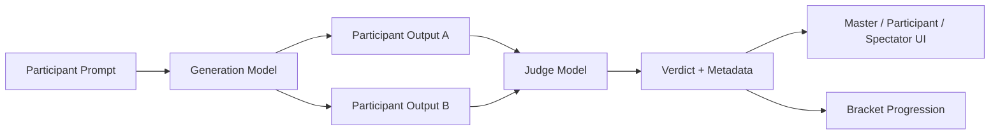

# PromptWars

[](https://github.com/ayanalamMOON/PromptWars/actions/workflows/ci.yml)
[](LICENSE)
[](https://github.com/ayanalamMOON/PromptWars)

PromptWars is a local-first AI prompt engineering tournament platform for live competitions, showcase demos, and judged prompt battles.

**Project website:** https://github.com/ayanalamMOON/PromptWars

## Overview

PromptWars turns prompt engineering into a structured competition flow:

1. Participants submit prompts.
2. A generation model produces one or more responses.
3. A separate judge model scores the outputs against the active rubric.
4. The system returns a verdict, updates match state, and advances the bracket when needed.

The project is designed for event-floor use, demo environments, and local hardware such as an RTX 4060 8GB. The current model strategy splits generation and judging so the app stays responsive while remaining explainable.

## What’s inside

- **`prompt-wars/`** — the main Next.js tournament application
- **`prompt-wars/ws-server/`** — WebSocket server used for live updates and streaming match events
- **`PromptWars_App/`** — the standalone Windows app packaging workspace
- **`PromptWars_Windows_Standalone/`** — desktop runtime bundle and launcher assets
- **`Showcase_App/`** — a lightweight demo and presentation app
- **`PWDocs/`** — planning, architecture, and launch documentation

## Why this project exists

PromptWars is built to make prompt competitions feel like a real live sport rather than a loose demo.

It focuses on:
- transparent judging,
- local inference instead of cloud dependence,
- tournament-ready match flows,
- participant, master, admin, and spectator views,
- and a clean path to standalone event deployment.

## Key features

### Local dual-model workflow

- Separate generation and judging models
- Optimized for constrained consumer GPUs
- Ollama-backed local inference
- Different decoding profiles for creativity and scoring consistency

Current recommended split:
- **Generation:** `llama3:latest`
- **Judging:** `llama3.2:3b`

### Tournament operations

- Match setup and bracket progression
- Participant registration and check-in
- Master controls and overrides
- Spectator-friendly live surfaces
- Analytics and health views
- Windows standalone packaging for offline or event-floor use

### Transparency and auditability

- Active model names shown in the UI
- Session-backed battle state
- Judge metadata and verdict details tracked per match
- Roadmap support for replay, diff forensics, confidence scoring, and tie-break handling

## Architecture snapshot

- **Frontend:** Next.js App Router, React, Tailwind CSS, Framer Motion
- **AI runtime:** Ollama-powered local models
- **State:** session-backed battle data and tournament flows
- **Deployment:** browser-based app plus optional standalone Windows bundle
- **Event transport:** WebSocket server for live match updates

### Battle flow



## Getting started

### Prerequisites

- Node.js 18+ recommended
- npm
- Ollama installed locally
- The required models pulled into Ollama

### Run the main app

```bash
cd prompt-wars
npm install
npm run dev
```

### Optional: run the WebSocket server

If you want live event updates, run the WebSocket server from `prompt-wars/ws-server/` alongside the app.

## Environment

Configure the app in `prompt-wars/.env` or `prompt-wars/.env.local` with:

- Ollama base URL
- generation model name
- judge model name
- optional fallback model name

## Build and test

```bash
cd prompt-wars
npm run build
npm run test:run
npm run typecheck
```

Optional linting:

```bash
cd prompt-wars
npm run lint
```

## Current model strategy

PromptWars is tuned for local 8GB-class hardware.

The current split keeps generation creative and judging lightweight:

- **Generation model:** `llama3:latest`
- **Judge model:** `llama3.2:3b`

This setup keeps the platform stable for live sessions while still producing clear, deterministic verdicts.

## Future plans

The next development wave focuses on making PromptWars more configurable, explainable, and tournament-ready.

### Priority 1 — highest impact

- Judge Rubric Control Panel
- Confidence and tie-break logic
- Model fallback chain
- Round replay and diff forensics

### Priority 2 — fairness and explainability

- Blind judging mode
- Explainable judge spectator panel
- Per-field model presets

### Priority 3 — operations and integrity

- Auto bracket progression
- Next-match queue board
- Soft penalty system
- Prompt similarity / plagiarism checks
- System health watchdog
- Immutable battle hash

### Longer-term goals

- richer replay and analytics history
- stronger dispute-resolution tooling
- better event operations visibility
- safer fallback behavior under hardware limits
- improved audit trails for live competitions

## Documentation

- [Feature roadmap](PWDocs/PromptWars_Feature_Depth_Execution_Roadmap.md)
- [Two-model update plan](PWDocs/PromptWars_Two_Model_ModelVisibility_Update_Plan.md)
- [Platform management brief](PWDocs/PromptWars_Platform_Management_Brief.tex)
- [Development plan](PWDocs/PromptWars_Dev_Plan.tex)

## Contributing

This project is evolving quickly. The most useful contributions are:

- better match lifecycle tooling,
- clearer judge explanations,
- replay and forensic UI,
- and stronger event-safe operational features.

## License

Released under the MIT License. See [LICENSE](LICENSE).
